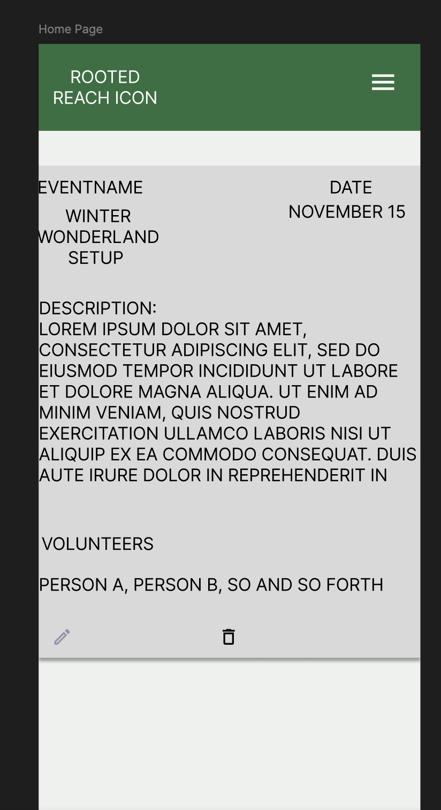
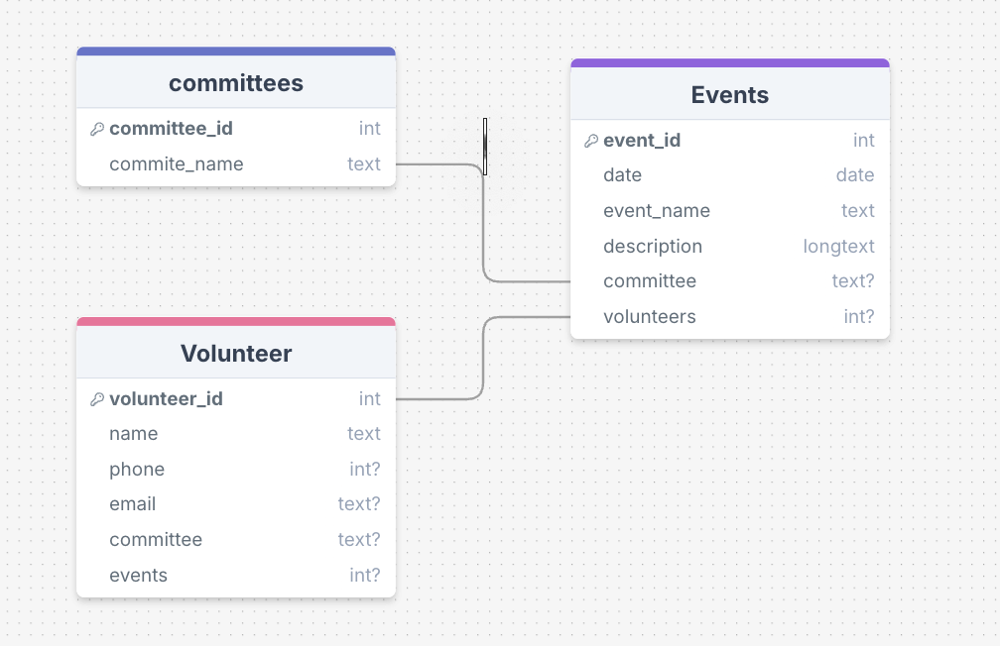

# Project Title

RootedReach

## Overview

RootedReach is a volunteer management dashboard. This will help to keep track of volunteers, and keep everyone updated of who is working on what, where and when.

Community organizations have a mission to serve the community and to offer a lifeline or means of communication between the district and the city. These neighborhood organizations in Milwaukee have a direct means of communication with the local alderman, and act as a medium to show the problems of the district to local government. What these organizations often lack is a clear calendar of events, an ability to manage volunteers in a quick and effective manner, and consistent ability to perform outreach with the community.

The Board maintains outreach through far 10+ groups and and beyond 20+ email groups that makes it very difficult to make contact with the right group. This can be a bit of a confusing task to remember which group is the most updated for the current purpose. On top of this managing a rotating list of volunteers that want to help out on very specific events can be very convoluted.

- [Project Title](#project-title)
  - [Overview](#overview)
- [Priority of implementation](#priority-of-implementation)
    - [User Profile](#user-profile)
      - [Things that users should be able to do](#things-that-users-should-be-able-to-do)
    - [Features](#features)
  - [Implementation](#implementation)
    - [Tech Stack](#tech-stack)
    - [Client libraries:](#client-libraries)
    - [APIs](#apis)
    - [Sitemap](#sitemap)
    - [Mockups](#mockups)
      - [Home Page](#home-page)
      - [Register Page](#register-page)
      - [Login Page](#login-page)
      - [Logout Page](#logout-page)
      - [List of Events](#list-of-events)
      - [Edit Event](#edit-event)
      - [Delete Event](#delete-event)
      - [List Committees](#list-committees)
      - [Delete Committees](#delete-committees)
      - [Add Committees](#add-committees)
      - [Create Volunteer](#create-volunteer)
      - [Delete Volunteer](#delete-volunteer)
      - [Edit Volunteer](#edit-volunteer)
      - [Create Email](#create-email)
      - [Send Email](#send-email)
    - [DataFlow](#dataflow)
    - [Endpoints](#endpoints)
    - [Auth](#auth)
  - [Roadmap](#roadmap)
  - [Nice-to-haves](#nice-to-haves)

# Priority of implementation

1. Minimum required items

- Create BackEnd and routes
  - Test routes in postman
- Create Seed DBS
  - Categories
  - Events
  - Contacts
- Pages to create

  - Home page
  - List Events
  - Edit Events
  - Delete Events
  - List Committees

  - Delete Committees

  - Add Committees

  - Create contact

  - Delete Contact

  - Edit Contact

  - Create email

  - Send Email

- AWS SES
  - Terraform

2. Authorization and login

- Login Page

- Log out Page

- Passport.jsx

### User Profile

- Board Member

#### Things that users should be able to do

- create contact lists

- Add contacts

- Edit Contacts

- Delete contacts

- Manage assigning volunteers to specific events

- Manage an updateable calendar

- Manage outreach using email towards specified groups

### Features

- As a user I want to be able to create new contacts

  - Contact Data can have names, phones, emails, committees they are on, and type of events they want to volunteer for

  - The necessary contact field will be their name. Some community members prefer their privacy concerning the other data.

- As a user, I want to have the ability to edit the contacts

- As a user, I want to create a calendar event

- As a user, I want to delete a calendar Event

- As a user I want to edit a calendar event

  - Calendar Events should have a name, a description, and volunteers.

- As a user, I should be able to see the list of categories of events/committees.

- As a user, I must be able to send a mass email to a group.

## Implementation

### Tech Stack

- React

- Javascript

- MySQL

- Express

- Terraform

- AWS (Simple Email Service)

- Sass

- ShadCN for the UI components

### Client libraries:

- react

- react-router

- axios

- SASS

- Material UI or Shader CN

### APIs

- AWS Simple Email Service API

### Sitemap

- Home page

- Login Page

- Log out Page

- List Events

- Edit Events

- Delete Events

- List Committees

- Delete Committees

- Add Committees

- Create contact

- Delete Contact

- Edit Contact

- Create email

- Send Email

### Mockups

#### Home Page



#### Register Page


#### Login Page


#### Logout Page


#### List of Events


#### Edit Event


#### Delete Event


#### List Committees


#### Delete Committees


#### Add Committees


#### Create Volunteer


#### Delete Volunteer


#### Edit Volunteer


#### Create Email


#### Send Email


### DataFlow

()

### Endpoints

**GET /Volunteer** (done)
Gets list of Volunteer:
Parameters:

- volunteer_id - automatically generated ID that corresponds to a volunteer

- Name

- Phone number

- Committee

- Email

- Event_help: list of event names, they have signed up for.

Response:

```

[

{

"volunteer_id": 1,

"name": "Manuel Torres",

"phone_number": "1234567890",

"email": "email@email.com",

"committees": ["Weeding", "Butterfly", "Winter Lights"]

"event_help" :["halloween", "Music at the Gazebo", "Garden work day 6/6"],
},
{....},

...

]

```

**GET /Volunteers/:id** (done)

- Get user

Parameters:

- volunteer_id - automatically generated ID that corresponds to a volunteer

- Name

- Phone number

- Committee

- Email

- Event_help: list of event names, they have signed up for.

Response:

```

[

{

"volunteer_id": 1,

"name": "Manuel Torres",

"phone_number": "1234567890",

"email": "email@email.com",

"committees": ["Weeding", "Butterfly", "Winter Lights"],

"event_help" :["halloween", "Music at the Gazebo", "Garden work day 6/6"],

}

]

```

**Post /Volunteers/:id** (done)

- Create a new volunteer/Contact

Parameters:

- Volunteer_id - automatically generated ID that corresponds to a volunteer

- Name

- Phone number

- Committee

- Email

- Event_help: list of event names, they have signed up for.

[

{

"volunteer_id": 1,

"name": "Volunteer Here",

"phone_number": "1234567890",

"email": "volunteer@email.com",

"committees": [ "Butterfly", "Winter Lights", "Lawn'],

"event_help" :["halloween", "Music at the Gazebo", "Garden work day 6/6"],
}

]

**Patch /Volunteers/:id** (done)

- Edit a new volunteer/Contact

Parameters (just one field will need to be different):

- Volunteer_id - automatically generated ID that corresponds to a volunteer (unable to delete this field)

- Name

- Phone number

- Committee

- Email
-

[

{

"user_id": 1,

"name": "Volunteer Here",

"phone_number": "1234567890",

"email": "volunteer@email.com",

"Committees": [ "Butterfly", "Winter Lights", "Lawn']
}

]

**Delete /Volunteers/:id** (done)
 
- Deletes a Volunteer/Contact

Parameters (just one field will need to be different):

- Volunteer_id - automatically generated ID that corresponds to a volunteer

- Name

- Phone number

- Committee

- Email

[

204: content not found

]

**GET /Events/:id**

- Get Total List of Calendar Events

Parameters:

- Event_id: id tied to event

- Event Name: Name of the event

- Description: Event description or further details

- Committee - Committee or group of volunteers this can correspond to

- Volunteers: List of volunteers, that have signed up for the event.

Response:

```
{

"event_id": 1,

"event_name": "Winter Wonderland",

"date": "December 1 - January 14",

"description": "Lorem ipsum dolor sit amet, consectetur adipiscing elit, sed do eiusmod tempor incididunt ut labore et dolore magna aliqua",

"committee": "Winter Wonderland",

"volunteers": [userid_1, userid2, .... ],

}

```

**Post /Events**

- Create new Calendar Event

Parameters:

- Event_id: id tied to event

- Event Name: Name of the event

- Description: Event description or further details

- Committee - Committee or group of volunteers this can correspond to

- Volunteers: List of volunteers, that have signed up for the event. (optional)

Response:

```
[
{

"event_id": 1,

"event_name": "Winter Wonderland",

"date": "December 1 - January 14",

"description": "Lorem ipsum dolor sit amet, consectetur adipiscing elit, sed do eiusmod tempor incididunt ut labore et dolore magna aliqua",

"committee": "Winter Wonderland",

"volunteers": [userid_1, userid2, .... ],

},
....
]
```

**Patch /Events/:id**

- update an event

Parameters:

- Event_id: id tied to event

- Event Name: Name of the event

- Description: Event description or further details

- Committee - Committee or group of volunteers this can correspond to

- Volunteers: List of volunteers, that have signed up for the event.

Response:

```
[
{

"event_id": 1,

"event_name": "Winter Wonderland",

"date": "December 1 - January 14",

"description": "Lorem ipsum dolor sit amet, consectetur adipiscing elit, sed do eiusmod tempor incididunt ut labore et dolore magna aliqua",

"volunteers": [userid_1, userid2, .... ],

},
....
]

```

**Delete /Events/:id**

- Delete Calendar Event

Parameters:

- Event_id: id tied to event

- Event Name: Name of the event

- Description: Event description or further details

- Committee - Committee or group of volunteers this can correspond to

- Volunteers: List of volunteers, that have signed up for the event. (optional)

Response:

```
[
204: content not found
]
```

**Post /Users/Register**

- Add a user account

Parameters:

- email: User's email

- password: User's provided password

Response:

```

{

"token": "seyJhbGciOiJIUzI1NiIsInR5cCI6IkpXVCJ9.eyJzdWIiOiIxMjM0NTY3ODkwIiwibmFtZSI6I..."

}

```

**POST /users/login**

- Login a user

Parameters:

- email: User's email

- password: User's provided password

Response:

```

{

"token": "seyJhbGciOiJIUzI1NiIsInR5cCI6IkpXVCJ9.eyJzdWIiOiIxMjM0NTY3ODkwIiwibmFtZSI6I..."

}
```

**GET /categories**

Gets list of categories/Committees:

Parameters:

- Category

Response:

```

[

"weeding",
"butterfly garden",
"landscaping",
"Halloween",
"winter lights set up",
"Winter Lights management",
"july 4th",
"Marketing",
"Farmers Market",
]

```

**Post /categories**
Add new Category/Committee:

Parameters:

- Category

Response:

```

[

"weeding",
"butterfly garden",
"landscaping",
"Halloween",
"winter lights set up",
"Winter Lights management",
"july 4th",
"Marketing",
"Farmers Market",
"NEW ITEM HERE"
]

```

**Delete/categories/categoryItem**
Delete a Category/Committee:

Parameters:

- Category

IE: delete /categories/FarmersMarket

Response:

```

[

"weeding",
"butterfly garden",
"landscaping",
"Halloween",
"winter lights set up",
"Winter Lights management",
"july 4th",
"Marketing",

]

```

### Auth

- JWT auth

- Before adding auth, all API requests will be using a fake user with id 1

- Added after core features have first been implemented

- Store JWT in localStorage, remove when a user logs out

- Add states for logged in showing different UI in places listed in mockups

## Roadmap

**_Create server_**

- express project with routing, with placeholder 200 responses

**_Create client_**

- react project with routes and boilerplate pages

**_Create migrations_**

- 10 random events to be seeded into a DB

- Create 5-10 random events/committees. to be seeded into a DB

- Create 10 users, to be seeded into a DB

- Create seeds with sample café data

- Deploy client and server projects so all commits will be reflected in production

**_Features concerning Volunteers_**

- List All volunteers on a specific page

- Edit volunteers on a specific page (includes delete icon/option)

- Delete a volunteer confirmation/modal

- Add a new volunteer

- Ability to assign events to a volunteer

  **_Endpoints Involved_**

- GET /volunteers endpoint - List all volunteers
- Post/Events Endpoint - Create a new volunteer
- Patch/Events Endpoint - Edit or update a volunteer
- Delete/Events Endpoint - Delete a volunteer
- **_Event Features_**
- List Events on a specific page

- Edit an event page

- Delete an Event confirmation

- Add a new Event

- Add a category(ies)/committee(s) to an event

- Add A volunteer(s) to an event

  **_Endpoints Involved_**

- GET /events endpoint - List all Events
- Post/Events Endpoint - Create a new event
- Patch/Events Endpoint - Edit or update an event
- Delete/Events Endpoint - Delete an event

**_Feature: Users_**

- Create a User
- User Login Page
- Create a new User Page
- Login as a User

      ***Endpoints Involved***

- Post /Users/Register - add a user
- POST /users/login

**_Feature: Category_**

- Add a new category
- Delete a category

      ***Endpoints Involved***

- Post /categories
- Delete/categories/categoryItem

**Feature: Home page**

- shows the upcoming event on the calendar

- Feature: Create account

- Implement register page + form

- Create POST /users/register endpoint

**Feature: Implement JWT tokens**

- Server: Update expected requests / responses on protected endpoints

- Client: Store JWT in local storage, include JWT on axios calls

- Bug fixes
- DEMO DAY

## Nice-to-haves

- Integrate Google Places / Maps showing event locations

- Draft Emails

- AWS SES has an email limit of 200 emails per day, with only 50 emails sent at a time

  - Understand how to loop through a email list greater than 50 people, and send emails in batches
  - There also may be better options out there.

- Implement AWS SMS to send out text reminders

- Draft Text message

- If working on an email, and you navigate to another page, Can you save the email text to session/Local storage for the page to remember

- Forgot password functionality

- Volunteer (customer facing view over administrative view) interface -
  - See what events are available
  - See what events can be signed up for
  - remove themself from Events from events
